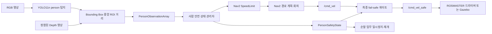

# YOLO 사람 탐지·Nav2 안전 제어 구조

## 1. 목표와 설계 원칙

이 기능은 RGB-D 카메라에서 사람을 탐지하고, 거리에 따라 순찰 로봇을 감속하거나
정지한다. 핵심 원칙은 **Nav2의 장애물 회피를 대체하지 않는 것**이다.

- Nav2는 LiDAR와 costmap을 이용해 경로 계획과 일반 장애물 회피를 계속 담당한다.
- YOLO는 카메라 영상에서 `person`이라는 의미 정보를 제공한다.
- Depth는 탐지된 사람까지의 거리를 제공한다.
- 안전 관리자는 거리와 데이터 신선도를 상태로 변환한다.
- `SLOW`는 Nav2 공식 `nav2_msgs/SpeedLimit` 입력으로 처리한다.
- `STOP`과 센서 장애는 모터 직전 `/cmd_vel` 게이트에서 최종적으로 0을 강제한다.

이 구조에서는 YOLO가 Nav2의 속도 명령을 직접 만들지 않는다. 따라서 두 제어기가
서로 다른 방향의 속도를 동시에 명령하는 충돌을 피할 수 있다.



## 2. 구현 결과물

| 패키지 | 역할 |
|---|---|
| `hazard_guard_interfaces` | 사람 관측과 안전 상태 ROS 메시지 |
| `hazard_guard_person_detection` | YOLO11n 추론, 사람 필터, RGB-D 거리, 주석 영상 |
| `hazard_guard_safety_supervisor` | 안전 상태 머신, Nav2 속도 제한, 최종 속도 게이트 |
| `hazard_guard_mission_manager` | 안전 정지 때 현재 웨이포인트 보존 및 재개 |
| `hazard_guard_simulation` | 시뮬레이터·실물 launch 토픽 연결 |

주요 토픽은 다음과 같다.

| 토픽 | 형식 | 의미 |
|---|---|---|
| `/hazard_guard/person/observations` | `PersonObservationArray` | 사람 bbox, confidence, 거리 |
| `/hazard_guard/person/annotated_image` | `sensor_msgs/Image` | 사람 bbox가 표시된 RGB 영상 |
| `/hazard_guard/person/safety_state` | `PersonSafetyState` | 현재 안전 상태와 원인 |
| `/speed_limit` | `nav2_msgs/SpeedLimit` | Nav2 controller의 백분율 속도 제한 |
| `/cmd_vel` | `geometry_msgs/Twist` | Nav2 또는 수동 제어가 만든 원래 명령 |
| `/cmd_vel_safe` | `geometry_msgs/Twist` | 안전 게이트를 지난 모터용 최종 명령 |

## 3. 상태와 기본 기준값

| 상태 | 기본 조건 | 동작 |
|---|---|---|
| `CLEAR` | 2.5 m 밖 또는 사람 없음 | Nav2 제한 해제, 주행 허용 |
| `CAUTION` | 1.8~2.5 m 또는 거리 미확정 | 경고 상태, 기존 Nav2 주행 유지 |
| `SLOW` | 0.9~1.8 m | Nav2 속도를 기본 45%로 제한 |
| `STOP` | 0.9 m 이내 | 최종 속도 0, 활성 Nav2 goal 취소 |
| `SENSOR_FAULT` | 관측 단절, Depth 단절·비정합·미검증 | 최종 속도 0, 임무 일시정지 |

위 값은 코드 기본값일 뿐 실물 안전 기준이 아니다. 진입은 즉시 반영하고, 사람이
멀어질 때는 0.2 m 히스테리시스와 2초 `clear hold`를 적용한다. 안전 상태가
해제되면 임무 관리자는 취소했던 **같은 웨이포인트**를 Nav2에 다시 요청한다.

> `SpeedLimit.speed_limit=0`은 Nav2에서 정지가 아니라 제한 해제를 뜻한다. 그래서
> STOP은 반드시 `/cmd_vel_safe` 게이트가 담당한다.

최종 게이트는 안전 상태뿐 아니라 원래 `/cmd_vel` 입력도 감시한다. Nav2 또는
velocity smoother가 0.5초 이상 새 명령을 보내지 않으면 마지막 non-zero 명령이
모터에 남지 않도록 주기적으로 0을 발행한다.

## 4. YOLO·Jetson 환경 기준

- 모델: Ultralytics YOLO11n detection
- 가중치: COCO pretrained `yolo11n.pt`
- 클래스: `person`, COCO class ID 0
- 기본 입력: 640×640, confidence 0.4, 추론 10 Hz
- 초기 검증: PyTorch `.pt`
- 운영 후보: 대상 Jetson에서 직접 생성한 TensorRT FP16 `.engine`
- Ultralytics: 팀원이 검증한 정확한 버전을 우선하며, 미확정 시 `8.4.118`은 후보일 뿐이다.

Jetson에서는 일반 PyPI `torch`로 기존 NVIDIA 빌드를 덮어쓰지 않는다. 상세 설치와
환경 기록 형식은 [YOLO_JETSON_SETUP.md](YOLO_JETSON_SETUP.md)를 따른다.

## 5. 빌드

```bash
cd ~/hazard-guard-robot
source /opt/ros/humble/setup.bash
test -f /opt/rosmaster_ws/install/setup.bash \
  && source /opt/rosmaster_ws/install/setup.bash

colcon build --symlink-install
source install/setup.bash
```

모델 파일은 저장소에 커밋하지 않는다.

```bash
mkdir -p runtime/models
# 검증된 yolo11n.pt를 runtime/models에 배치
python3 tools/check_yolo_environment.py \
  --model runtime/models/yolo11n.pt
```

## 6. 시뮬레이터 실행

기본값은 기존 기능을 보호하기 위해 `use_person_safety:=false`이다. 모델과
Ultralytics 환경이 준비된 뒤 명시적으로 켠다.

지도 작성과 Nav2:

```bash
ros2 launch hazard_guard_simulation navigation.launch.py \
  gui:=true \
  use_person_safety:=true \
  person_model_path:=$PWD/runtime/models/yolo11n.pt
```

저장 지도 기반 순찰:

```bash
ros2 launch hazard_guard_simulation localization.launch.py \
  gui:=true \
  map:=$PWD/runtime/maps/<map-name>.yaml \
  use_person_safety:=true \
  person_model_path:=$PWD/runtime/models/yolo11n.pt
```

Gazebo에서는 `/camera/image_raw`과 `/depth_camera/image_raw`을 사용한다. 실제 모델
추론 없이 안전 제어만 반복 검증하는 ROS 통합 테스트도 포함되어 있다.

```bash
colcon test --packages-select \
  hazard_guard_person_detection \
  hazard_guard_safety_supervisor \
  hazard_guard_mission_manager \
  hazard_guard_simulation
colcon test-result --verbose
```

## 7. Jetson 실물 실행

HP60C 드라이버까지 한 번에 시작하는 경우:

```bash
ros2 launch hazard_guard_simulation physical_patrol.launch.py \
  map:=$PWD/runtime/maps/<map-name>.yaml \
  use_person_safety:=true \
  start_person_camera:=true \
  person_model_path:=$PWD/runtime/models/yolo11n.pt \
  person_device:=0 \
  person_depth_registration_verified:=true
```

다른 터미널에서 HP60C 드라이버를 이미 실행했다면 중복 실행을 막는다.

```bash
ros2 launch hazard_guard_simulation physical_patrol.launch.py \
  map:=$PWD/runtime/maps/<map-name>.yaml \
  use_person_safety:=true \
  start_person_camera:=false \
  person_model_path:=$PWD/runtime/models/yolo11n.pt \
  person_device:=0 \
  person_depth_registration_verified:=true
```

실물 입력은 다음 제조사 토픽을 사용한다.

- RGB: `/ascamera_hp60c/camera_publisher/rgb0/image`
- Depth: `/ascamera_hp60c/camera_publisher/depth0/image_raw`

`person_depth_registration_verified`의 기본값은 `false`다. 이 상태에서 안전 기능을
켜면 의도적으로 `SENSOR_FAULT`가 되어 주행하지 않는다. RGB와 Depth가 같은 해상도,
같은 픽셀의 같은 물체를 나타내는지 실물에서 확인한 뒤에만 `true`로 바꾼다. 단순히
두 토픽이 발행된다는 이유로 정합 완료로 판단해서는 안 된다.

## 8. 현장 검증 순서

1. 로봇 바퀴를 지면에서 띄우거나 비상 정지가 가능한 공간에서 시작한다.
2. RGB와 Depth가 같은 장면·해상도·광학축으로 정합되어 있는지 확인한다.
3. 정지 상태에서 한 사람을 3 m, 2 m, 1.5 m, 0.8 m에 배치한다.
4. 관측 거리, 상태, `/speed_limit`, `/cmd_vel_safe`를 동시에 기록한다.
5. 저속 직선 주행에서 `SLOW` 감속과 `STOP` 정지를 확인한다.
6. 사람이 물러난 뒤 2초가 지나 같은 웨이포인트로 재개하는지 확인한다.
7. 카메라 토픽 또는 탐지 노드를 끊어 `SENSOR_FAULT` 정지를 확인한다.
8. 조도, 역광, 가림, 여러 사람, 측면 진입 조건을 반복한다.

추천 기록 명령:

```bash
ros2 topic echo /hazard_guard/person/safety_state
ros2 topic echo /speed_limit
ros2 topic hz /hazard_guard/person/observations
ros2 topic hz /cmd_vel_safe
```

## 9. 아직 실물에서 검증해야 하는 사항

- HP60C RGB와 Depth의 픽셀 정합 및 시간 차이
- 0.9/1.8/2.5 m 임계값과 45% 감속값의 현장 적합성
- Jetson에서 YOLO11n PyTorch FPS, p95 지연시간, CPU/GPU/RAM, 온도
- TensorRT FP16 변환 후 탐지 결과 동등성
- 제조사 bringup 내부 remap을 거쳐 모터가 `/cmd_vel_safe`만 소비하는지
- 사람 진입부터 실제 바퀴 정지까지의 총 정지 거리
- 탐지 누락·오탐·카메라 단절 시 fail-safe 동작

이 기능은 아직 인증된 산업 안전 장치가 아니다. 실물 검증이 끝날 때까지 낮은 속도,
물리 비상 정지, 안전요원 감독을 함께 사용해야 한다.
